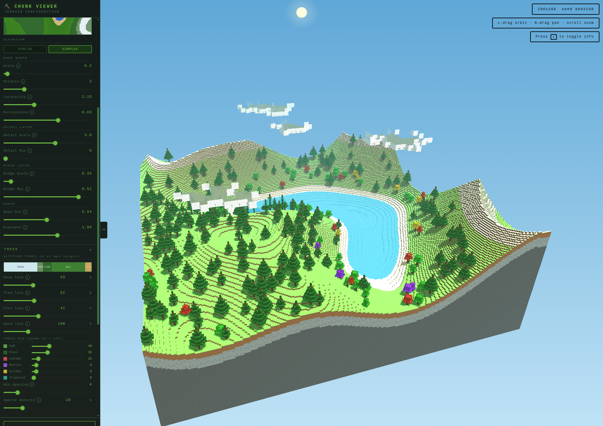

# Minecraft World Generator



A Minecraft-like procedural world generator with configurable terrain generation. Explore procedurally generated voxel terrain with Perlin or Simplex noise, ridge layers for mountain peaks, and multiple tree types with altitude-based placement.

## Features

- **Terrain** — Procedural height maps with Perlin or Simplex noise. Configurable scale, octaves, lacunarity, persistence, and ridge layers for sharp mountain peaks.
- **Trees** — Six tree types (Oak, Pine, Autumn, Mystic, Golden, Tropical) with altitude-based placement. Snow line, tree line, and pine line control where each type grows.
- **Sky & Time** — Dynamic day/night cycle with sun and moon arcs, stars at night, and a configurable cloud layer.
- **Controls** — Left-drag to orbit, right-drag to pan, scroll to zoom. Tree settings auto-update the map. Press `i` to toggle the info modal.

## Tech Stack

- **Three.js** (r128) — 3D rendering
- Vanilla JavaScript, HTML, CSS

## Getting Started

Open `minecraft-world-generator.html` in any browser. No server required — all textures are procedurally generated, so the file can be opened directly from disk.

**Contributors:** The Contributors tab loads from `contributors/people/*.json`. After adding or editing files in that folder, run `node scripts/build-contributors.js` to regenerate the list.

### Project Structure

```
minecraft-world-generator/
├── minecraft-world-generator.html   # Main HTML entry point
├── app.js                 # Application logic, world gen, Three.js
├── styles.css             # Styles
├── preview.png            # Screenshot preview
├── todo.readme            # Things needing to be added
├── contributors/          # Per-file contributor entries
│   └── people/            # One .json per contributor
├── scripts/
│   └── build-contributors.js   # Run to regenerate contributors list
└── README.md
```

## Controls

| Action | Input |
|--------|-------|
| Orbit camera | Left mouse drag |
| Pan | Right mouse drag |
| Zoom | Scroll wheel |
| Toggle info | Press `i` |
| Collapse sidebar | Click the sidebar edge toggle |

## Configuration

All settings are in the sidebar:

- **Chunk Size** — 16 to 1024 blocks
- **Noise** — Perlin/Simplex, scale, octaves, lacunarity, persistence, ridge and detail layers
- **Trees** — Snow/tree/pine/sand lines, tree counts per type, min spacing
- **Sky** — Time of day, cloud height, speed, amount, size, opacity

## License

MIT
